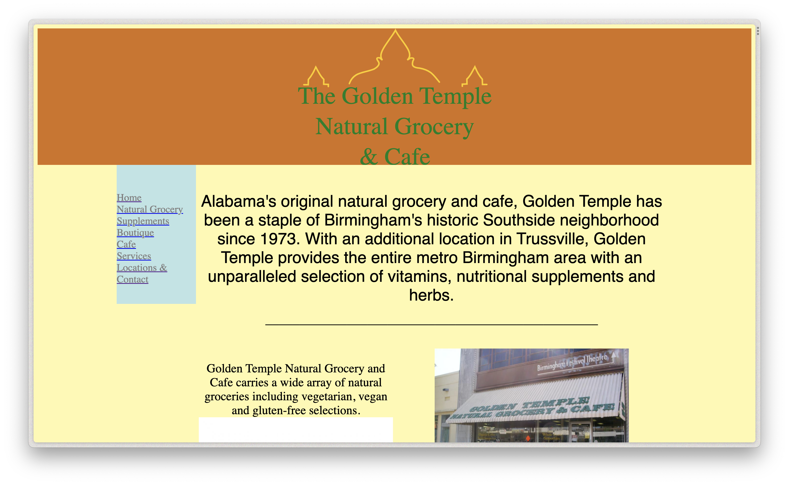
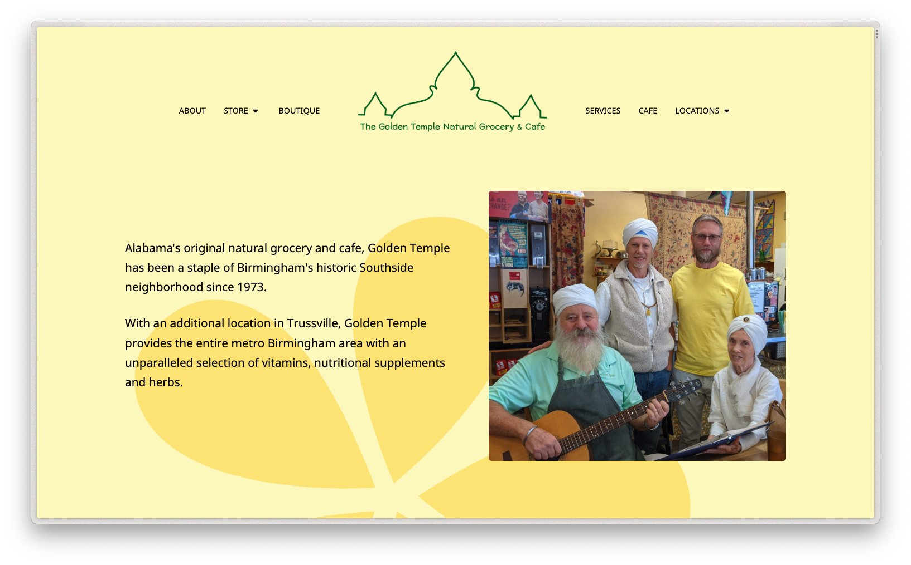

# golden temple

The Golden Temple is a beloved small business and community hub that has served the Birmingham metro area since 1973. Their website, which was constructed in pure vintage HTML, was ready for a modern responsive upgrade.

I rewrote the site in semantic HTML, and rendered it using custom CSS styles. I also included a small amount of lightweight vanilla JavaScript to build a few features and to automate updating the copyright year. I handwrote all of the code myself, and did not use any libraries.

I also did all the visual design and a little bit of branding. The site is typeset in [Nokora](https://fonts.google.com/specimen/Nokora/about?query=Danh+Hong), with [Preahvihear](https://fonts.google.com/specimen/Preahvihear/about?query=Danh+Hong) as the accent/heading font. Both were designed by [Danh Hong](https://github.com/danhhong).

Before:

After:

