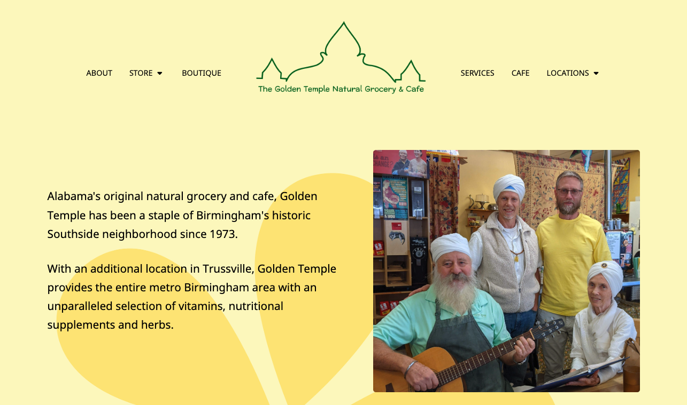

# golden temple

A modern, responsive website for community health food store, boutique, and cafe, The Golden Temple ✨

The Golden Temple is a beloved small business and community hub that has served the Birmingham metro area since 1973.

Before:

I rewrote the HTML to be modern and semantic, and rendered it using custom CSS styles. I included a small amount of lightweight vanilla JavaScript to build a few features and to automate updating the copyright year. I handwrote all of the code myself, and did not use any libraries.

After:

I also did a little bit of branding and designed the visuals myself, in order to evoke a bit of personality and specificity. The site is typeset in [Nokora](https://fonts.google.com/specimen/Nokora/about?query=Danh+Hong), with [Preahvihear](https://fonts.google.com/specimen/Preahvihear/about?query=Danh+Hong) as the accent/heading font. Both were designed by [Danh Hong](https://github.com/danhhong).
